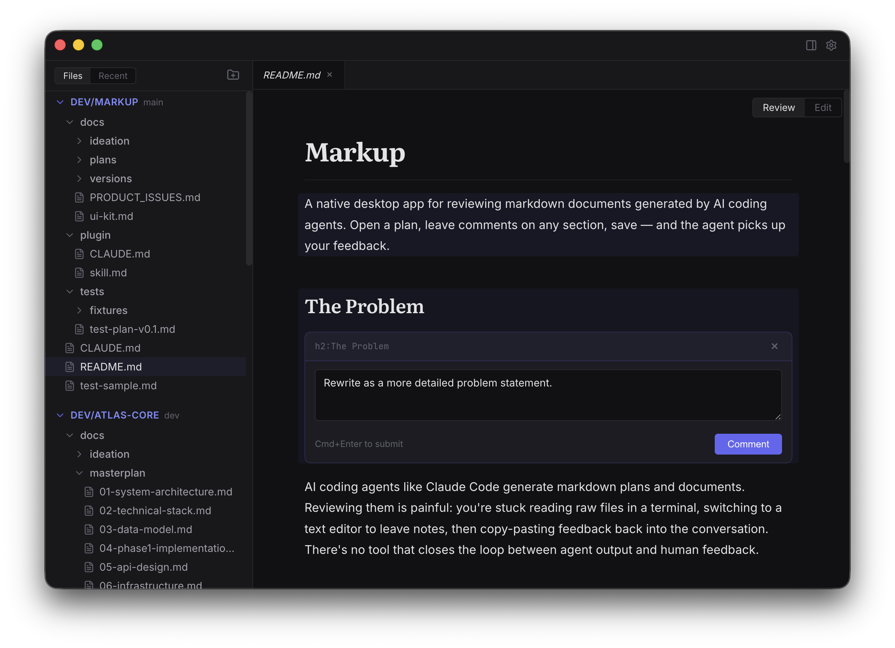

# Markup

**Review AI plans. Leave feedback that sticks.**

A native macOS app for reviewing markdown documents generated by AI coding agents. Open a plan, click any section to leave a comment, save — and the agent picks up your feedback.



## The Problem

AI coding agents generate markdown plans and documents. Reviewing them is painful: you're stuck reading raw files in a terminal, switching to a text editor to leave notes, then copy-pasting feedback back into the conversation. There's no tool that closes the loop between agent output and human feedback.

## How It Works

1. **Agent generates a markdown plan** (e.g., `docs/plans/feature-plan.md`)
2. **Open it in Markup** — rendered beautifully, not raw text
3. **Click any block to leave a comment** — headings, paragraphs, tables, code blocks, lists
4. **Save** — comments are embedded as invisible HTML comments in the file
5. **Agent reads the file** and addresses your feedback, then removes resolved comments

## Features

**Review** — Beautiful rendered markdown with Literata headings, Inter body text, JetBrains Mono code. Click any block to add inline comments. Document-level comments for general feedback.

**Navigate** — Multi-folder workspace with tree view and recently updated files. Tabbed editor with VS Code-style preview mode. Document outline panel.

**Edit** — Toggle between Review and Edit mode (Cmd+E). CodeMirror 6 with markdown syntax highlighting. File watching with external change detection.

**Agent Integration** — Ships with a Claude Code plugin. The agent learns to parse `@markup` comments, address your feedback, and remove resolved comments automatically.

## Install

Download the latest release from [GitHub Releases](https://github.com/radjay/markup/releases/latest), or build from source:

```bash
git clone https://github.com/radjay/markup.git
cd markup
npm install
npm run dev
```

## Build

```bash
npm run build    # Production build
npm run dist     # Package as macOS DMG
```

## Comment Format

Comments use the `@markup` format — invisible in any standard markdown renderer, machine-parseable by agents:

```html
<!-- @markup {"type":"inline","anchor":"h2:Architecture"} Consider a modular monolith instead. -->
```

See [plugin/CLAUDE.md](plugin/CLAUDE.md) for full agent integration instructions.

## Keyboard Shortcuts

| Shortcut | Action |
|----------|--------|
| Cmd+O | Open file |
| Cmd+S | Save |
| Cmd+E | Toggle Review/Edit mode |
| Cmd+W | Close tab |
| Cmd+Enter | Submit comment |
| Escape | Close comment panel |

## Tech Stack

Electron 41 · React 19 · TypeScript · electron-vite · CodeMirror 6 · react-markdown

## License

MIT
