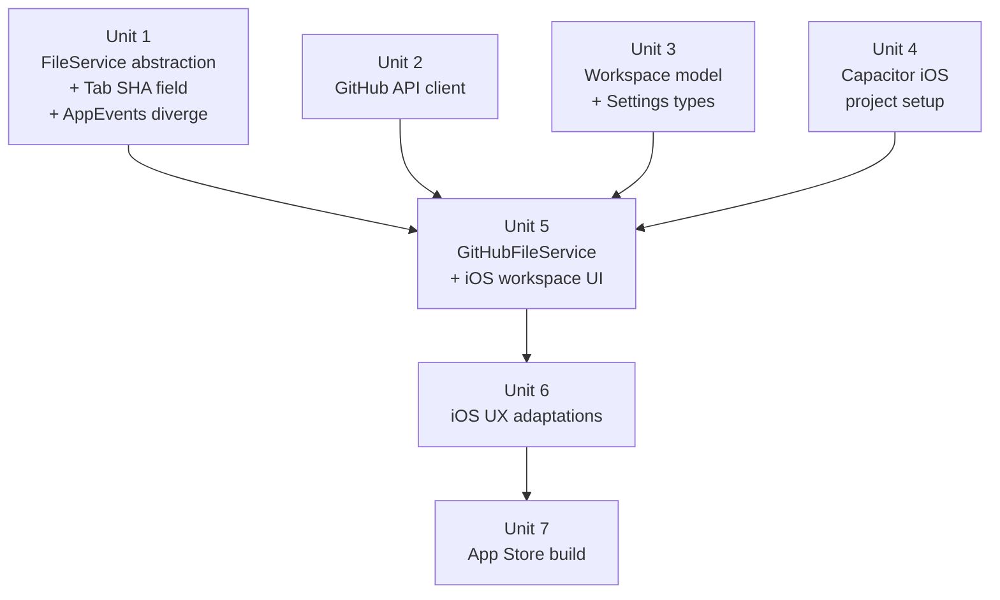

# feat: iOS App via Capacitor with GitHub Remote Repos

## Overview

Bring Markup to iPhone and iPad using Capacitor — a native iOS wrapper around the existing React web app. Because mobile devices don't have local git repos, the workspace model shifts from local filesystem folders to GitHub remote repos. Users connect repos via a GitHub Personal Access Token (PAT), browse their markdown files, leave inline and document-level comments, and save feedback back to GitHub as commits.

The existing renderer (~95% of the codebase) runs unchanged inside WKWebView. The required changes are: (1) introducing a `FileService` abstraction to decouple the renderer from Electron IPC, (2) diverging `useAppEvents` into Electron and iOS platform implementations, (3) implementing the abstraction against the GitHub Contents and Trees APIs, and (4) adding Capacitor's iOS project scaffold.

## Problem Frame

Markup's audience — developers reviewing AI-generated plans — works across devices. A plan drops into their GitHub repo and they want to review and annotate it from their phone or iPad while away from their desk. The Electron app can't run on iOS. The renderer is already a clean React web app; Capacitor makes it an iOS app without a component rewrite.

The mobile constraint also removes the local-folder model: mobile devices don't run coding agents and don't have repos checked out. GitHub remote repos replace local folders as the workspace primitive.

## Requirements Trace

- R1. iOS app available on iPhone and iPad via the App Store
- R2. Connect one or more GitHub repos as workspaces (replaces local folder picker)
- R3. Browse markdown files in a connected repo's file tree
- R4. Open, read, and render markdown files with inline and document-level comment support
- R5. Save comments back to GitHub as a commit (using the GitHub Contents API PUT endpoint)
- R6. GitHub PAT authentication stored securely in the iOS Keychain
- R7. All existing comment formats (`@markup` inline, `@markup-doc-comments` block) work identically to the desktop app
- R8. Edit mode and review mode parity with the desktop app
- R9. iPhone-optimized layout (collapsible sidebar, drawer-style right panel); iPad uses the existing side-by-side layout

## Scope Boundaries

- macOS Electron app is unchanged — this plan adds iOS as a second target, not a replacement
- Android is out of scope (Capacitor supports it; save for a follow-on plan)
- GitHub OAuth device flow is deferred — PAT-only for v1; OAuth can replace it without changing the rest of the architecture
- File watching / push notifications for new files is deferred — users pull-to-refresh instead
- Local iCloud Drive or Files.app access is out of scope for v1
- No new comment features; feature parity with the desktop app is the ceiling

## Context & Research

### Relevant Code and Patterns

- `src/shared/types.ts` — `WatchedFile` already has `repoName`, `repoBranch`, `repoPath` fields, anticipating a remote-file model. `FileEntry` is generic enough for GitHub tree entries. `Tab` (defined in `src/renderer/src/hooks/useTabs.ts`) holds per-tab file state including `rawContent` — it needs a `sha?: string` field added for the GitHub blob SHA lifecycle.
- `src/renderer/src/lib/markdown/comments.ts` — pure TypeScript, zero Electron or DOM dependencies. Ports to iOS unchanged.
- `src/renderer/src/hooks/useWorkspace.ts` — 131 lines; all `window.electronAPI` calls are concentrated here. ~6 call sites to replace.
- `src/renderer/src/hooks/useActiveDocument.ts` — 248 lines; ~4 call sites for file read and save. Contains a 300ms autosave debounce loop that fires `saveFile` on every comment mutation — this loop needs serialization on iOS to prevent self-inflicted SHA conflicts (see Key Technical Decisions).
- `src/renderer/src/hooks/useTabs.ts` — 146 lines; imperative `watchFile(path)` / `unwatchFile(path)` calls on every tab open/close, plus a tab confirm dialog. These are not simply file I/O — they are tab lifecycle hooks.
- `src/renderer/src/hooks/useAppEvents.ts` — wires Electron-specific side-channel behaviors: native menu bar events (`onMenuOpenFile`, `onMenuSave`, `onMenuAddFolder`, `onMenuToggleMode`, `onMenuOpenSettings`), a 500ms `pollPendingFiles` loop for CLI-opened files, and DOM drag-and-drop event registration. **None of these translate to iOS.** This hook must be diverged into platform-specific implementations rather than wrapped in `FileService`.
- `src/preload/index.ts` — the `contextBridge`/`ipcRenderer` bridge. The full typed API surface this replaces is documented in `src/shared/ipc-channels.ts`.
- `src/renderer/src/components/Layout/WelcomeScreen.tsx` — the empty-state UI, needs a GitHub-connect CTA on mobile.
- `src/renderer/src/components/Sidebar/FileTree.tsx` — renders a `folders: { path: string; files: FileEntry[] }[]` prop, where `folderPath` is used for the display name (via last two path segments) and the remove callback. On iOS the workspace identifier is a `GitHubRepo` object, not a filesystem path — the display name derivation and `onRemoveFolder(folderPath)` callback signature need adaptation.

### Institutional Learnings

- No prior mobile or GitHub API work has been documented in this repo. This is greenfield.

### External References

- [Capacitor + React setup — capacitorjs.com](https://capacitorjs.com/solution/react)
- [GitHub REST: repository contents — docs.github.com](https://docs.github.com/en/rest/repos/contents)
- [GitHub REST: Git trees — docs.github.com](https://docs.github.com/en/rest/git/trees)
- [GitHub REST: rate limits — docs.github.com](https://docs.github.com/en/rest/using-the-rest-api/rate-limits-for-the-rest-api) — 5,000 req/hr for authenticated users; ample for interactive use
- [Fine-grained PATs (GA March 2025) — github.blog](https://github.blog/changelog/2025-03-18-fine-grained-pats-are-now-generally-available/)
- [Expo DOM Components — expo.dev](https://expo.dev/blog/the-magic-of-expo-dom-components) — noted as an upgrade path if native shell becomes desirable
- [@capacitor/preferences — capacitorjs.com](https://capacitorjs.com/docs/apis/preferences) — Keychain-backed on iOS
- [WKWebView virtual keyboard handling — developer.apple.com](https://developer.apple.com/documentation/uikit/keyboards_and_input)

## Key Technical Decisions

- **Capacitor over React Native:** The renderer is already a complete web app. Capacitor wraps it in WKWebView with near-zero component rewrites. React Native would require rewriting every JSX element, replacing CodeMirror 6 (no DOM equivalent in RN), and discarding `react-markdown`. For a document reviewer (text-heavy, no 60 fps animation needs), WKWebView performance is sufficient.

- **FileService abstraction for file I/O; platform divergence for app events:** `FileService` covers all file I/O, settings, workspace management, and change notification. However, `useAppEvents.ts` is not a file I/O hook — it wires Electron menu bar events, a CLI polling loop, and drag-and-drop. These have no iOS equivalents and cannot be abstracted. Instead, `useAppEvents.ts` remains Electron-specific and a new `useIOSAppEvents.ts` is introduced for iOS toolbar actions. `App.tsx` selects between them based on build mode.

- **GitHub PAT over OAuth device flow for v1:** PAT requires no callback URL, no app registration, and no server-side component. Fine-grained PATs (GA March 2025) can be scoped to `Contents: read+write` on specific repos. OAuth device flow is the right upgrade path for a public App Store release but adds setup complexity that is avoidable in v1.

- **GitHub Contents API PUT for saves (commit per save):** `PUT /repos/{owner}/{repo}/contents/{path}` creates or updates a file in a single commit. It requires the file's current blob `sha` (returned when the file was fetched). This replaces `file:save` IPC cleanly. Each save generates a commit with an auto-generated message ("Markup review: {filename}").

- **SHA stored on the `Tab` object, not on `FileData`:** The blob SHA returned by `getFileContent` must survive the call to `openFileInTab(path, content)`. The `Tab` interface in `useTabs.ts` is extended with `sha?: string` in Unit 1. `GitHubFileService.saveFile` reads `sha` from the current tab's state rather than from `FileData`. `ElectronFileService` leaves `sha` undefined — the existing save path is unaffected.

- **Autosave serialized on iOS to prevent self-conflict:** The existing 300ms autosave debounce in `useActiveDocument.ts` fires `saveFile` on every comment mutation. On the local filesystem this is safe. On the GitHub Contents API, rapid successive saves will generate 409 conflicts because each save changes the blob SHA and the next save still carries the old one. The mitigation is to serialize saves: each PUT waits for the previous to return and updates the stored `sha` before the next save may fire. An alternative is to disable autosave on iOS and require explicit save; both are acceptable but save serialization preserves UX consistency.

- **Recursive tree fetch over per-directory listing:** `GET /repos/{owner}/{repo}/git/trees/{sha}?recursive=1` returns the full file tree in one call. For plan/doc repos this is well under the 100,000 entry limit. This replaces `file:listDirectory` with a single request per repo session.

- **PAT stored in Capacitor Preferences (Keychain-backed):** `@capacitor/preferences` uses the iOS Keychain on mobile, satisfying App Store guidelines for token storage.

- **Separate Vite config for the iOS/Capacitor build:** `electron-vite` is a build tool that unconditionally produces three bundles (main, preload, renderer) with Electron-specific assumptions. The Capacitor build requires a standalone renderer-only bundle with no Electron or Node.js globals. This is achieved with a separate `vite.config.capacitor.ts` that invokes Vite directly (not `electron-vite`), using `mode: 'ios'` to tree-shake Electron-specific code. The `package.json` `build:ios` script runs `vite build --config vite.config.capacitor.ts`.

- **`GitHubRepo` type is canonical in `src/shared/types.ts`:** Defining it in both `src/shared/types.ts` and `src/lib/github/types.ts` would create two conflicting canonical sources. `GitHubRepo` is defined once in `src/shared/types.ts` and imported by `src/lib/github/GitHubClient.ts`. GitHub-API-internal types (`GitHubTreeEntry`, `GitHubFileContent`, typed error classes) live in `src/lib/github/types.ts`.

- **iPhone layout as drawer model:** The desktop three-pane layout (sidebar | editor | right panel) collapses on iPhone to a single main pane with a drawer-slide sidebar and a bottom-sheet or slide-in right panel. The iPad retains the desktop split-pane layout, which already works well at tablet dimensions.

## Open Questions

### Resolved During Planning

- **Can CodeMirror 6 run in WKWebView?** Yes — WKWebView uses JavaScriptCore (same engine as Safari desktop). CodeMirror 6 is built for modern browsers and has no Electron-specific dependencies. The known issue is virtual keyboard viewport resizing, handled in Unit 6 via `visualViewport` resize events.
- **What GitHub API scope is required?** `Contents: read` to browse and read files. `Contents: write` to save comments back. Both are available on fine-grained PATs scoped to specific repos.
- **Are rate limits a concern?** No. 5,000 requests/hour for authenticated users. A typical Markup session (auth check, fetch branch, fetch tree, open 5–10 files, save 2–3) uses ~20–25 requests.
- **Does `src/shared/types.ts` need changes for GitHub repos?** Yes: add `GitHubRepo` type, extend `WorkspaceSettings.repos: GitHubRepo[]`, and add `sha?: string` to the `Tab` interface in `useTabs.ts` for blob SHA lifecycle management.
- **Can `useAppEvents.ts` be abstracted into `FileService`?** No. It wires Electron menu events, a CLI polling loop, and drag-and-drop — all Electron-specific side channels with no iOS equivalents. It must be diverged into a new `useIOSAppEvents.ts` rather than wrapped.
- **Will the autosave loop cause 409 conflicts on the GitHub API?** Yes — the existing 300ms autosave fires `saveFile` on every comment mutation. Rapid successive saves will conflict because each PUT changes the blob SHA. Mitigation: serialize saves so each PUT waits for the previous to return before the next may fire, carrying the updated SHA forward.

### Deferred to Implementation

- **Capacitor live reload setup for development** — whether `cap run ios` with hot-reload against the standalone Vite dev server needs proxy configuration. Prototype this early in Unit 4 before committing to the build pipeline shape.
- **Blob SHA management across edits from other users** — when a user opens a file, edits, then someone else commits on the same branch before the user saves, the stored `sha` will be stale and the API will return a 409. The correct handling (warn, re-fetch, merge UI) should be designed at implementation time. The autosave serialization mitigation addresses self-conflicts, not multi-user conflicts.
- **Repo tree filtering** — currently `listDirectory` returns only `.md` files. The GitHub tree endpoint returns all files; client-side filtering to `.md` only is applied in `getRepoTree`. The `.md`-only filter is committed for v1; `.mdx` and other extensions can be added in a follow-on.
- **Initial loading states** — network latency on mobile means file trees and file content take non-zero time. Skeleton loading patterns are an implementation detail.

## High-Level Technical Design

> *This illustrates the intended approach and is directional guidance for review, not implementation specification. The implementing agent should treat it as context, not code to reproduce.*

The central change is replacing the Electron IPC seam with a `FileService` interface for file I/O, and diverging `useAppEvents` into platform-specific implementations:

```
┌──────────────────────────────────────────────────────────────┐
│                     Renderer (React)                          │
│                                                               │
│  useWorkspace / useActiveDocument / useTabs                   │
│           │                                                   │
│           ▼                                                   │
│  FileServiceContext.Provider                                  │
│           │                                                   │
│    ┌──────┴──────┐                                            │
│    │             │                                            │
│    ▼             ▼                                            │
│  ElectronFile  GitHubFile                                     │
│  Service       Service                                        │
│    │             │                                            │
│    ▼             ▼                                            │
│  window.       GitHubClient                                   │
│  electronAPI   (fetch-based)                                  │
│                                                               │
│  App.tsx selects platform events hook:                        │
│    ┌──────────────────┐   ┌──────────────────┐               │
│    │ useAppEvents     │   │ useIOSAppEvents   │               │
│    │ (Electron menus, │   │ (toolbar buttons, │               │
│    │  CLI poll,       │   │  no-op poll,      │               │
│    │  drag-drop)      │   │  no drag-drop)    │               │
│    └──────────────────┘   └──────────────────┘               │
└──────────────────────────────────────────────────────────────┘
         ↑                        ↑
   Electron main           GitHub REST API
   (IPC, Node fs)    (Contents, Trees, Repos)
```

The `FileService` interface surface covers file I/O, workspace management, settings, and change notification. It does **not** cover menu events, CLI integration, drag-and-drop, or app icon switching — those are platform event concerns handled by the separate hooks.

```
interface FileService {
  // Workspace
  listWorkspaces(): Promise<Workspace[]>
  addWorkspace(): Promise<Workspace | null>
  removeWorkspace(id: string): Promise<void>

  // File tree
  listDirectory(workspaceId: string, path?: string): Promise<FileEntry[]>

  // File I/O (sha is present for remote files, undefined for local)
  readFile(workspaceId: string, path: string): Promise<FileData & { sha?: string }>
  saveFile(workspaceId: string, path: string, content: string, sha?: string): Promise<{ sha?: string }>

  // Tab lifecycle (no-op on iOS — no chokidar watching)
  watchFile(path: string): Promise<void>
  unwatchFile(path: string): Promise<void>

  // Git / repo metadata
  getWorkspaceMetadata(): Promise<Record<string, { name: string; branch: string }>>

  // Recents
  listRecentFiles(): Promise<WatchedFile[]>

  // Settings
  loadSettings(): Promise<WorkspaceSettings>
  saveSettings(settings: WorkspaceSettings): Promise<void>

  // Change events (chokidar on Electron, no-op on iOS)
  onFileChanged(cb: (path: string) => void): () => void
  onFileAdded(cb: (filePath: string, folder?: string) => void): () => void  // folder arg matches actual Electron IPC signature; optional on iOS
  onFileRemoved(cb: (filePath: string, folder?: string) => void): () => void
}
```

`saveFile` returns `{ sha?: string }` so the caller can update the stored blob SHA after a successful GitHub PUT. On Electron it returns `{}`.

The autosave save loop in `useActiveDocument` must serialize calls: if a save is in-flight, queue the next save rather than firing it immediately. After the in-flight save resolves, update the tab's `sha`, then fire the queued save with the new SHA.

## Implementation Units



Units 1–4 are all independent and can proceed in parallel.

---

- [ ] **Unit 1: FileService Abstraction, Tab SHA Field, and AppEvents Divergence**

**Goal:** Introduce a `FileService` interface and an `ElectronFileService` implementation so the renderer no longer references `window.electronAPI` directly. Add `sha?: string` to the `Tab` interface for the blob SHA lifecycle. Diverge `useAppEvents.ts` into Electron and iOS platform-specific hooks. The Electron app continues to work identically after this unit.

**Requirements:** R4, R5, R7, R8 (enables all downstream platform-specific implementations)

**Dependencies:** None

**Files:**
- Create: `src/lib/platform/FileService.ts` — the interface definition (full surface as shown in High-Level Technical Design)
- Create: `src/lib/platform/ElectronFileService.ts` — wraps `window.electronAPI` calls; `watchFile`/`unwatchFile` map to existing IPC; `getWorkspaceMetadata` maps to `getGitInfo`; `onFileAdded`/`onFileRemoved` map to the existing add/remove events; `watchFile`/`unwatchFile` forward to the existing IPC channels; `saveFile` returns `{}` (no SHA)
- Create: `src/lib/platform/FileServiceContext.tsx` — React context + `useFileService()` hook
- Create: `src/renderer/src/hooks/useIOSAppEvents.ts` — iOS platform hook; wires toolbar actions for open/save/settings; no-ops the 500ms `pollPendingFiles` loop; no drag-and-drop listener registration
- Modify: `src/renderer/src/hooks/useAppEvents.ts` — no behavior changes; remains Electron-specific
- Modify: `src/renderer/src/hooks/useWorkspace.ts` — replace `window.electronAPI.*` with `useFileService()`
- Modify: `src/renderer/src/hooks/useActiveDocument.ts` — replace `window.electronAPI.*` with `useFileService()` at all call sites including `reloadFile()` (line 193, used by pull-to-refresh and ExternalChangeBar — must also update `shaRef.current` with the freshly fetched sha); add save serialization (`isSaving` ref + `pendingSave` flag + `shaRef` as described above)
- Modify: `src/renderer/src/hooks/useTabs.ts` — add `sha?: string` to `Tab` interface; extend `openFileInTab` signature to `(filePath, content, pinned, sha?)` and store sha on the tab; replace `window.electronAPI.watchFile/unwatchFile` with `useFileService()` at all 4 imperative call sites (lines 100, 103, 111, 121); add `shaRef` to `useActiveDocument` for mutable SHA tracking (see save serialization in approach above)
- Modify: `src/renderer/src/App.tsx` — wrap with `FileServiceContext.Provider`; select between `useAppEvents` (Electron) and `useIOSAppEvents` (iOS) based on build mode
- Modify: `src/renderer/src/env.d.ts` — scope `window.electronAPI` type to Electron build only
- Test: `src/lib/platform/__tests__/FileService.test.ts`

**Approach:**
- The `FileService` interface surface covers all 17+ IPC methods. `ElectronFileService` is a thin pass-through for every method — no logic changes.
- `watchFile`/`unwatchFile` are included in `FileService` because `useTabs.ts` calls them imperatively on tab open/close — specifically at lines 100, 103, 111, and 121 (tab preview replacement, open, pin, and close). `GitHubFileService` implements them as no-ops; pull-to-refresh in Unit 6 provides manual refresh only (no background polling).
- `getWorkspaceMetadata` replaces `getGitInfo`; it returns `{ name, branch }` per workspace ID. On iOS this data comes from `GitHubRepo.repo` and `GitHubRepo.branch` directly.
- Save serialization in `useActiveDocument`: the autosave callback checks an `isSaving` ref; if true, sets a `pendingSave` boolean flag rather than calling `saveFile`. The `pendingSave` flag is lossy by design — it always saves the latest in-memory state, not a queue of intermediate states. This is correct because `saveRef.current()` always serializes the current comment state at the moment it fires. When a save completes: (a) update `shaRef.current` (a mutable ref) to the new blob SHA immediately and synchronously before any state update (avoids closure-staleness from async React re-renders); (b) if `pendingSave` is true, clear the flag and fire `saveRef.current()` — it will read the updated `shaRef.current`. On save failure: clear `pendingSave`, set a tab-level error state that blocks further autosave until the user acknowledges. The sha must be stored in a mutable ref (not React state) so the next save closure always reads the freshest value without waiting for a re-render cycle.
- `window.electronAPI` must not appear outside `ElectronFileService.ts` after this unit.

**Patterns to follow:**
- IPC channel names from `src/shared/ipc-channels.ts`
- Type shapes from `src/shared/types.ts` — `FileData`, `FileEntry`, `WatchedFile`, `WorkspaceSettings`

**Test scenarios:**
- Happy path: `ElectronFileService.readFile()` calls `window.electronAPI.readFile()` with the correct path and returns `FileData`
- Happy path: `ElectronFileService.saveFile()` calls `window.electronAPI.saveFile()` and resolves, returning `{}`
- Happy path: `ElectronFileService.saveFile()` rejection from the underlying IPC propagates — the promise rejects with the original error rather than silently resolving
- Happy path: `ElectronFileService.listWorkspaces()` invokes the correct IPC channel and returns the workspace array
- Happy path: `ElectronFileService.loadSettings()` invokes the correct IPC channel and returns `WorkspaceSettings`
- Happy path: `ElectronFileService.saveSettings()` invokes the correct IPC channel with the settings payload
- Happy path: `ElectronFileService.listRecentFiles()` invokes the correct IPC channel and returns `WatchedFile[]`
- Happy path: `ElectronFileService.removeWorkspace()` invokes the correct IPC channel with the workspace ID
- Happy path: `useFileService()` throws if called outside a `FileServiceContext.Provider`
- Happy path: after `onFileChanged` registers a callback and an event fires, the callback is invoked; after calling the returned unsubscribe function, a subsequent event does NOT invoke the callback
- Happy path: `ElectronFileService.listDirectory()` rejection propagates to the caller
- Edge case: `ElectronFileService.listDirectory()` called with a path that returns an empty array propagates the empty result correctly
- Integration: save serialization — when a second `saveFile` is triggered while the first is in-flight, the second call is queued; after the first resolves with a new `sha`, the queued call fires with the updated `sha`

**Verification:**
- `npm run typecheck` passes with no new errors — note: `tsconfig.web.json` currently includes only `src/renderer/src/**/*` and `src/shared/**/*`; add `src/lib/**/*` to the include array so the new `src/lib/platform/` and `src/lib/github/` files are covered by typecheck
- The Electron app launches and all existing functionality works unchanged — open file, leave comment, save, reload, verify comment persists
- `window.electronAPI` does not appear in any file outside `ElectronFileService.ts` — note: App.tsx contains 3 direct calls that are Electron-specific (`onMenuOpenSettings`, `saveSettings`, `setAppIcon`); these must be handled in App.tsx itself via build-mode guards or moved into `ElectronFileService` / `useAppEvents` (see Open Questions)
- No regression in the existing comment round-trip on Electron

---

- [ ] **Unit 2: GitHub API Client**

**Goal:** A pure TypeScript `GitHubClient` class that wraps the GitHub REST API endpoints needed for browsing and editing repo files. No React or Capacitor dependencies — usable from any environment.

**Requirements:** R2, R3, R4, R5, R6

**Dependencies:** None (can be built in parallel with Units 1, 3, 4)

**Files:**
- Create: `src/lib/github/GitHubClient.ts`
- Create: `src/lib/github/types.ts` — GitHub-API-internal types (`GitHubTreeEntry`, `GitHubFileContent`) and typed error classes (`GitHubAuthError`, `GitHubNotFoundError`, `GitHubConflictError`, `GitHubForbiddenError`). `GitHubRepo` is defined in `src/shared/types.ts` and imported here.
- Create: `src/lib/github/__tests__/GitHubClient.test.ts`

**Approach:**
- All requests use the native `fetch` API (available in modern browsers and WKWebView) — no axios or node-fetch
- Constructor accepts `{ token: string }` — the PAT or OAuth token
- Methods: `getAuthenticatedUser()`, `listRepos()`, `listBranches(owner, repo)`, `getRepoTree(owner, repo, sha, rootPath?)`, `getFileContent(owner, repo, path, ref?)`, `putFileContent(owner, repo, path, content, sha, message)`, `getBranchSha(owner, repo, branch)`
- `getRepoTree` fetches `?recursive=1`, applies `rootPath` prefix filtering client-side if provided, then filters to `.md` files
- `getFileContent` uses `Accept: application/vnd.github.raw` for the raw bytes and returns `{ content: string, sha: string }` — the `sha` is required for safe saves (note: the correct GitHub media type for raw file bytes is `application/vnd.github.raw`, not `application/vnd.github.raw+json`)
- `putFileContent` uses `PUT /repos/{owner}/{repo}/contents/{path}` with a JSON body containing `{ message, content: base64EncodedContent, sha }` — content must be UTF-8-safe base64 encoded before transmission (use `btoa(String.fromCharCode(...new TextEncoder().encode(content)))` rather than `btoa(content)` directly, as `btoa()` throws `InvalidCharacterError` on any non-Latin-1 character; markdown files with em dashes, curly quotes, or non-ASCII text will crash saves otherwise)
- Error handling: surface `401` as `GitHubAuthError`, `404` as `GitHubNotFoundError`, `409` as `GitHubConflictError`, `403` as `GitHubForbiddenError` (covers rate limit and insufficient scope)

**Patterns to follow:**
- `nanoid` (already a dep) for any client-generated IDs
- Existing `fetch`-based patterns are not established in this repo — use idiomatic `async/await` with typed response interfaces

**Test scenarios:**
- Happy path: `getAuthenticatedUser()` returns an object with a `login` string field on 200
- Happy path: `listRepos()` returns an array of objects with `owner`, `name`, `defaultBranch` fields
- Happy path: `listBranches(owner, repo)` returns an array of branch name strings for a valid repo
- Happy path: `getBranchSha(owner, repo, branch)` returns the tree SHA for the branch head — note this requires two calls: first `GET /repos/{owner}/{repo}/branches/{branch}` returns the commit SHA, then `GET /repos/{owner}/{repo}/git/commits/{commit_sha}` returns `tree.sha`. The Trees API requires the tree SHA, not the commit SHA.
- Happy path: `getRepoTree()` returns only `.md` entries from a mixed-extension tree, with `path` and `sha` fields present on each entry
- Happy path: `getFileContent()` returns `{ content: string, sha: string }` for a known file path
- Happy path: `putFileContent()` resolves successfully and the commit SHA is returned; the `content` field in the request body is the base64 encoding of the input string
- Error path: `getAuthenticatedUser()` throws `GitHubAuthError` on a 401 response
- Error path: `getFileContent()` throws `GitHubNotFoundError` on a 404 response
- Error path: `putFileContent()` throws `GitHubConflictError` on a 409 response (stale SHA)
- Error path: `putFileContent()` throws `GitHubForbiddenError` on a 403 response (insufficient PAT scope)
- Error path: `listRepos()` throws `GitHubForbiddenError` on a 403 response (rate limited)
- Error path: `getBranchSha()` throws `GitHubNotFoundError` on 404 (branch does not exist)
- Edge case: `getRepoTree()` with a repo containing no `.md` files returns an empty array
- Edge case: `getRepoTree()` with a non-empty `rootPath` excludes entries outside that subdirectory path prefix
- Edge case: `putFileContent()` called with a `content` string that contains multi-byte UTF-8 characters produces a valid base64 encoding (not truncated)

**Verification:**
- All methods callable from a browser environment (no Node.js-specific imports)
- `npm run typecheck` passes
- Tests pass against mock `fetch` responses matching the GitHub API shapes

---

- [ ] **Unit 3: GitHub Workspace Model and Settings**

**Goal:** Extend `WorkspaceSettings` to hold GitHub repos alongside the existing `folders` array. Add the `GitHubRepo` type to the shared type system. Ensure the Electron app's settings continue to work unchanged when no repos are configured.

**Requirements:** R2, R6

**Dependencies:** None (can be built in parallel with Units 1, 2, 4)

**Files:**
- Modify: `src/shared/types.ts` — add `GitHubRepo` type; extend `WorkspaceSettings` with `repos: GitHubRepo[]`
- Modify: `src/main/settings.ts` — ensure the default settings shape includes `repos: []` for backward compatibility with existing `markup-settings.json` files

**Approach:**
- `GitHubRepo` shape: `{ id: string, owner: string, repo: string, branch: string, rootPath?: string }` — `rootPath` allows scoping to a subdirectory (e.g. `docs/plans`) rather than the whole repo root. `id` is a `nanoid`-generated stable identifier used as the workspace key.
- `GitHubRepo` is defined in `src/shared/types.ts` (canonical). `src/lib/github/GitHubClient.ts` imports it from there.
- `WorkspaceSettings.repos` defaults to `[]` — existing settings files without the field deserialize cleanly
- The `folders` field on `WorkspaceSettings` is unchanged — both coexist in the same settings object

**Patterns to follow:**
- Existing type shapes in `src/shared/types.ts` — follow the same naming and structure conventions

**Test scenarios:**
- Edge case: Loading a `markup-settings.json` that has no `repos` field produces a settings object with `repos: []`
- Happy path: A settings object with both `folders` and `repos` round-trips through JSON serialization without data loss

**Verification:**
- `npm run typecheck` passes
- Electron app starts and loads existing settings without errors on a machine without a `repos` field in its settings file

---

- [ ] **Unit 4: Capacitor iOS Project Setup**

**Goal:** Add Capacitor to the project, configure a standalone Vite build for the iOS target, and generate the iOS Xcode project. The iOS app should launch in a simulator showing the Markup UI.

**Requirements:** R1

**Dependencies:** None (can proceed in parallel with Units 1–3; must complete before Unit 5)

**Files:**
- Create: `capacitor.config.ts` — Capacitor configuration (app ID `com.markup.app.ios`, web dir `dist/ios/`, server settings)
- Create: `vite.config.capacitor.ts` — standalone Vite config for the iOS renderer build; does NOT use electron-vite; sets `mode: 'ios'`, `build.outDir: 'dist/ios'`, excludes Electron/Node globals via `define`
- Modify: `package.json` — add `@capacitor/core`, `@capacitor/ios`, `@capacitor/cli`, `@capacitor/preferences` as dependencies; add `build:ios` (`vite build --config vite.config.capacitor.ts --mode ios`), `cap:sync`, `cap:run`, `cap:open` scripts
- Create: `ios/` — generated by `cap add ios` (committed to repo as the Xcode project)
- Modify: `ios/App/App/Info.plist` — app display name "Markup", `NSAppTransportSecurity` allowance for `api.github.com`
- Create: `ios/App/App/Assets.xcassets/AppIcon.appiconset/` — app icon assets

**Approach:**
- **electron-vite is not used for the iOS build.** `electron-vite build` unconditionally produces three bundles (main, preload, renderer) with Electron-specific assumptions; it cannot produce a standalone renderer bundle for Capacitor. A separate `vite.config.capacitor.ts` invokes Vite directly with `mode: 'ios'` so that `import.meta.env.MODE === 'ios'` guards in `App.tsx` can tree-shake `ElectronFileService` and `useAppEvents` from the bundle.
- App ID: `com.markup.app.ios` (distinct from the Electron `com.markup.app` to avoid App Store conflicts)
- `ios/` directory should be committed — it is the Xcode project, not a generated artifact

**Execution note:** Prototype the standalone Vite build and `cap run ios` with live-reload before investing in Units 5–7. Confirm: (a) the renderer bundle loads in WKWebView without Electron-related errors; (b) hot-reload from the Vite dev server works with `cap run ios --livereload`. If the standalone Vite build and electron-vite conflict on shared config (e.g. `base` path, target), resolve the conflict before proceeding.

**Test scenarios:**
- Test expectation: none — this unit is project scaffolding. Verification is the app launching in the iOS Simulator.

**Verification:**
- `npm run build:ios` succeeds and produces output in `dist/ios/`
- The `dist/ios/` bundle contains no imports of `electron`, `chokidar`, or Node.js built-in modules
- `cap sync ios` completes without errors
- `cap run ios` launches the app in the iOS Simulator showing the Markup welcome screen

---

- [ ] **Unit 5: GitHubFileService, iOS Workspace UI, and FileTree Adaptation**

**Goal:** Implement `FileService` backed by `GitHubClient` and build the UI for connecting GitHub repos, browsing their file trees, and opening files. Adapt `FileTree.tsx` workspace display for the GitHub repo model. This is the core iOS workflow: PAT → repo picker → file tree → open file → comment → save.

**Requirements:** R2, R3, R4, R5, R6, R7, R8

**Dependencies:** Units 1, 2, 3, 4

**Files:**
- Create: `src/lib/platform/GitHubFileService.ts` — implements `FileService` using `GitHubClient`
- Create: `src/lib/platform/CapacitorStorageService.ts` — wraps `@capacitor/preferences` for PAT storage and local settings persistence (Keychain-backed on iOS)
- Modify: `src/renderer/src/App.tsx` — detect `import.meta.env.MODE === 'ios'` and wire `GitHubFileService` + `CapacitorStorageService` as the providers
- Modify: `src/renderer/src/components/Layout/WelcomeScreen.tsx` — add GitHub connect CTA when no repos are configured
- Modify: `src/renderer/src/components/Settings/SettingsModal.tsx` — add GitHub PAT input field and repo management section (add/remove repos); hide `appIcon` picker on iOS (not applicable)
- Modify: `src/renderer/src/components/Sidebar/SidebarHeader.tsx` — on iOS, show `repo.repo` as display name and `repo.branch` instead of the filesystem path-derived label
- Modify: `src/renderer/src/components/Sidebar/FileTree.tsx` — accept a workspace identifier that may be a `GitHubRepo` ID rather than a filesystem path; derive the display name from `GitHubRepo.repo` when available; pass the workspace ID (not path) to the `onRemoveFolder` callback
- Create: `src/renderer/src/components/GitHub/RepoPicker.tsx` — modal that calls `GitHubClient.listRepos()` and `listBranches()`, then calls `FileService.addWorkspace()` with the selected repo
- Test: `src/lib/platform/__tests__/GitHubFileService.test.ts`
- Note: `src/renderer/src/hooks/useTabs.ts` was already extended with `sha?: string` and the new `openFileInTab` signature in Unit 1; Unit 5 uses these — no re-modification needed

**Approach:**
- `GitHubFileService.readFile()` fetches via `GitHubClient.getFileContent()` and returns `{ content, sha }`. The `sha` is stored on the tab via `openFileInTab(path, content, false, sha)` (the `Tab` interface was extended in Unit 1).
- `GitHubFileService.saveFile(workspaceId, path, content, sha)` calls `GitHubClient.putFileContent()` with the provided `sha` and commit message `"Markup review: {filename}"`. Returns `{ sha: newSha }` so the caller (save serialization logic from Unit 1) can update `tab.sha`.
- `GitHubFileService.saveFile()` throws `GitHubConflictError` on 409 — it does NOT swallow the error. The UI layer catches it and shows a toast.
- `GitHubFileService.listDirectory()` calls `GitHubClient.getRepoTree()` with the `GitHubRepo.rootPath` if set, and converts `GitHubTreeEntry[]` to `FileEntry[]`.
- `GitHubFileService.watchFile()` / `unwatchFile()` / `onFileChanged()` / `onFileAdded()` / `onFileRemoved()` are no-op stubs. `onFileChanged/Added/Removed` each return a no-op function `() => void`.
- `GitHubFileService.getWorkspaceMetadata()` returns `{ [repo.id]: { name: repo.repo, branch: repo.branch } }` from local settings — no API call needed.
- PAT is stored via `CapacitorStorageService` under key `github.token`. If no PAT exists, `GitHubFileService` methods that require auth throw `GitHubAuthError` immediately rather than making unauthenticated requests.
- `FileTree.tsx` adapts: when the workspace identifier is a `GitHubRepo.id`, look up the repo in settings to get the display name. The remove callback receives the workspace `id` string, which maps to `FileService.removeWorkspace(id)`.

**Patterns to follow:**
- `src/renderer/src/components/Sidebar/FileTree.tsx` — existing tree rendering to mirror
- `src/renderer/src/components/Settings/SettingsModal.tsx` — existing settings form pattern
- `GitHubRepo` type must be imported from `src/shared/types.ts` (defined in Unit 3); do not redefine locally in `GitHubFileService` or any component

**Test scenarios:**
- Happy path: `GitHubFileService.readFile()` returns `{ content: string, sha: string }` for a valid path
- Happy path: `GitHubFileService.saveFile()` calls `putFileContent` with the correct path, base64-encoded content, and the `sha` passed in; returns `{ sha: newSha }`
- Happy path: `GitHubFileService.listDirectory()` returns `FileEntry[]` with the correct shape from a GitHub tree response
- Happy path: `GitHubFileService.onFileChanged()` returns a callable function; calling the returned function does not throw
- Error path: `GitHubFileService.readFile()` propagates `GitHubNotFoundError` when the file does not exist
- Error path: `GitHubFileService.saveFile()` propagates `GitHubConflictError` when the API returns 409 — it does not catch-and-swallow
- Error path: `GitHubFileService.readFile()` throws `GitHubAuthError` when no PAT is available from `CapacitorStorageService`, rather than making an unauthenticated request
- Integration: `readFile` returns `{ content, sha }`; a comment is added via `comments.ts`; `saveFile` is called with the original `sha`; `putFileContent` is called with exactly that `sha` (not `undefined`, not a different value); the returned new `sha` is propagated back to the caller
- Integration: opening a file that already contains `@markup` inline comments, adding a new comment, and calling `saveFile` preserves the pre-existing comments in the serialized output
- Edge case: `GitHubFileService.listDirectory()` with a `rootPath`-scoped repo excludes entries outside that subdirectory

**Verification:**
- Full review flow on the iOS Simulator against a real GitHub repo: connect PAT → add repo → browse file tree → open file → leave inline comment → save → verify the raw file on GitHub contains the `<!-- @markup {...} -->` comment
- `npm run typecheck` passes

---

- [ ] **Unit 6: iOS UX Adaptations**

**Goal:** Adapt the layout and interaction model for iPhone and iPad: collapsible sidebar, proper virtual keyboard handling for CodeMirror, touch-friendly comment interactions, and pull-to-refresh for file changes.

**Requirements:** R9

**Dependencies:** Units 4, 5

**Files:**
- Modify: `src/renderer/src/App.tsx` — add a platform detection helper (`isIOS()`); apply iPhone layout class
- Modify: `src/renderer/src/styles.css` — add iOS-specific responsive rules (`@media (max-width: 768px)` for iPhone, iPad keeps the desktop layout); `env(safe-area-inset-*)` padding for notch and home indicator
- Modify: `src/renderer/src/components/Layout/EditorPane.tsx` — add `visualViewport` resize handler to shrink the editor height when the iOS keyboard appears (threshold: >100px difference between `window.innerHeight` and `window.visualViewport.height`)
- Modify: `src/renderer/src/components/Layout/TabBar.tsx` — hide the macOS `titlebar-drag` div on iOS; show a back-to-sidebar button on iPhone
- Modify: `src/renderer/src/components/Sidebar/SidebarHeader.tsx` — add a close/collapse button for iPhone drawer mode
- Modify: `src/renderer/src/components/Editor/ReviewMode.tsx` — ensure tap targets for commentable blocks meet 44pt minimum (Apple HIG)
- Create: `src/renderer/src/components/Layout/IOSPullToRefresh.tsx` — pull-to-refresh overlay that triggers a file re-fetch via `FileService`

**Approach:**
- iPhone layout: the sidebar slides in from the left as a full-screen drawer (CSS transform + transition). The right panel uses a bottom sheet (slides up from the bottom edge). The editor pane is full-width.
- iPad layout: the existing three-pane side-by-side layout works without significant changes; apply minor padding adjustments for safe areas.
- CodeMirror virtual keyboard: listen to `window.visualViewport.resize` and shrink the editor container's explicit height when the keyboard is open. Reset on keyboard dismiss.
- Pull-to-refresh: detect a downward overscroll gesture on the editor pane and trigger a file re-fetch. The existing `ExternalChangeBar.tsx` flow handles the content-changed notification.
- Comment trigger on touch: the existing click handler on `.commentable-block` works for tap on iOS; no long-press override needed for v1.

**Patterns to follow:**
- `src/renderer/src/components/Layout/ExternalChangeBar.tsx` — the existing external-change notification pattern
- Apple HIG 44px minimum touch target recommendation

**Test scenarios:**
- Test expectation: none — this unit is CSS layout, event handler wiring, and touch target sizing. All verification is manual on device/simulator and cannot be meaningfully unit-tested outside WKWebView.

**Verification:**
- On iPhone 15 Simulator: sidebar opens and closes as a drawer; right panel opens and closes as a bottom sheet; the editor is full-width
- On iPad Simulator: layout matches the desktop three-pane layout
- CodeMirror editor is not obscured by the iOS software keyboard when editing
- Pull-to-refresh triggers a file re-fetch and updated content appears
- All interactive elements meet 44pt minimum touch target size

---

- [ ] **Unit 7: App Store Build and Distribution**

**Goal:** Configure the iOS project for a production App Store build: signing, entitlements, app metadata, and an `xcodebuild archive` or `eas build` path.

**Requirements:** R1

**Dependencies:** Unit 6

**Files:**
- Modify: `ios/App/App/Info.plist` — final `NSHumanReadableDescription`, privacy usage strings
- Create: `ios/App/App/PrivacyInfo.xcprivacy` — required privacy manifest; declare network access (GitHub API) and Keychain usage
- Create: `ios/App/App/Markup.entitlements` — keychain access groups if needed for `@capacitor/preferences`
- Modify: `package.json` — add `dist:ios` script
- Create: `docs/ios-build.md` — build and signing setup instructions for the team

**Approach:**
- Signing is managed in Xcode (automatic signing with a developer account) or via `eas.json` if EAS Build is adopted
- The `appId` in `capacitor.config.ts` (`com.markup.app.ios`) must match the App Store Connect app identifier
- App icons: generate all required sizes from the existing `assets/icon.icns` source using `capacitor-assets` CLI
- App Store Connect requires a privacy policy URL; add a minimal privacy policy to `site/` before submitting
- No push notification entitlements needed for v1

**Execution note:** Signing setup requires a paid Apple Developer account. This unit documents the process rather than automating it, since certificates and provisioning profiles are developer-environment-specific.

**Test scenarios:**
- Test expectation: none — this unit is build configuration and documentation.

**Verification:**
- `npm run dist:ios` completes and produces an `.ipa` archive
- The app installs and runs on a physical iPhone and iPad device via TestFlight
- App Store Connect upload completes without validation errors

## System-Wide Impact

- **Interaction graph:** `FileService` replaces the entire `window.electronAPI` file I/O surface. `useWorkspace`, `useActiveDocument`, `useTabs`, and `App.tsx` are the call sites — approximately 20–25 locations. `useAppEvents.ts` is diverged into a separate `useIOSAppEvents.ts` rather than abstracted; the 500ms `pollPendingFiles` loop and all DOM drag-drop listeners are absent from the iOS build. All other components (`ReviewMode`, `EditMode`, `InlineComment`, `DocumentComments`, `FileTree`, `Outline`, `TabBar`) are largely unaffected except `FileTree.tsx`'s workspace display adaptation.
- **Autosave and SHA lifecycle:** The most important state invariant is that `tab.sha` stays current. The save serialization introduced in Unit 1 ensures that: (a) rapid comment edits do not generate concurrent PUTs with the same SHA, and (b) after each successful save, `tab.sha` is updated to the new blob SHA before the next save fires. If a save fails (409, network error), the error surface is a toast; `tab.sha` is not updated and the user may retry.
- **Error propagation:** `GitHubAuthError` (401, or no PAT) → redirect to PAT settings screen. `GitHubConflictError` (409) → toast with re-fetch option. `GitHubForbiddenError` (403, rate limit or scope) → toast with message. `GitHubNotFoundError` (404) → toast, close tab. Generic network errors → toast with retry option. The existing `ExternalChangeBar.tsx` pattern is the model for all toasts.
- **API surface parity:** The Electron build is unchanged. `ElectronFileService` is a complete implementation of `FileService` with identical behavior to the current `window.electronAPI` calls. The `Tab` interface gains `sha?: string` (optional field present on both platforms); `ElectronFileService.saveFile()` always returns `{}` so `tab.sha` remains `undefined` in the Electron path. Code that reads `tab.sha` should treat `undefined` as "no remote SHA tracked" rather than as an error.
- **Integration coverage:** The critical cross-layer scenario is: open file (GitHub fetch + `sha` stored on tab) → leave comment (comment engine serializes to markdown) → autosave queued and serialized → PUT commit with correct `sha` → new `sha` stored. This round-trip must be validated end-to-end in Unit 5's verification step using the iOS Simulator against a real GitHub repo.
- **Unchanged invariants:** The `@markup` and `@markup-doc-comments` comment format in `comments.ts` is not modified. All existing desktop-generated comments remain readable by the iOS app and vice versa. The `src/shared/types.ts` type additions are strictly additive — existing fields are unchanged.

## Risks & Dependencies

| Risk | Mitigation |
|------|------------|
| WKWebView virtual keyboard obscures CodeMirror | `visualViewport` resize handler in Unit 6; well-documented pattern with known workarounds |
| GitHub PAT stored insecurely | `@capacitor/preferences` uses iOS Keychain on device; token never written to plaintext storage |
| Autosave generates self-inflicted 409 conflicts | Save serialization in Unit 1: each PUT waits for the previous to resolve and updates `tab.sha` before firing the next |
| Stale SHA from concurrent external commit causes 409 | Surface as `GitHubConflictError` toast with re-fetch option; full conflict-resolution UI deferred |
| Electron app breaks during FileService refactor | `ElectronFileService` is a direct pass-through; full smoke-test of the Electron app is part of Unit 1 verification |
| `electron-vite` build is incompatible with the Capacitor web bundle | Use a separate `vite.config.capacitor.ts` — Vite directly, not electron-vite. Prototype the bundle output early in Unit 4 before committing to Units 5–7. |
| App Store review rejection for PAT input | Frame as a developer utility tool. If flagged under App Review guideline 2.5.4, the GitHub device flow OAuth upgrade resolves it without architecture changes |
| Capacitor plugin version incompatibilities | Pin exact versions; review `@capacitor/core` and `@capacitor/preferences` release notes before adopting |
| Recursive tree fetch too large for repos with many files | `?recursive=1` supports up to 100,000 entries; plan/doc repos are well under this. Add a client-side limit of 500 `.md` files with a warning banner |
| `FileTree.tsx` workspace ID assumption breaks with GitHub repo IDs | Unit 5 explicitly adapts the display name derivation and remove callback signature; tracked in the FileTree.tsx files list |

## Documentation / Operational Notes

- Add `cap sync` to the development workflow: after `npm install` or dependency changes, `npm run cap:sync` must be run to update the native project.
- The iOS app and Electron app share `src/shared/types.ts` and `src/lib/markdown/comments.ts` — changes to either must remain backward-compatible with both platforms.
- App Store Connect requires a privacy policy URL; add a minimal privacy policy to the existing marketing site (`site/`) before submitting.
- TestFlight is the recommended distribution path for team members before a public App Store release.
- Document the `vite.config.capacitor.ts` / `electron.vite.config.ts` dual-build setup in `CLAUDE.md` so future contributors understand why two build configs exist.

## Sources & References

- Related code: `src/shared/ipc-channels.ts`, `src/preload/index.ts`, `src/renderer/src/lib/markdown/comments.ts`, `src/renderer/src/hooks/useActiveDocument.ts`
- External docs: [capacitorjs.com/solution/react](https://capacitorjs.com/solution/react)
- External docs: [docs.github.com/en/rest/repos/contents](https://docs.github.com/en/rest/repos/contents)
- External docs: [docs.github.com/en/rest/git/trees](https://docs.github.com/en/rest/git/trees)
- External docs: [capacitorjs.com/docs/apis/preferences](https://capacitorjs.com/docs/apis/preferences)
